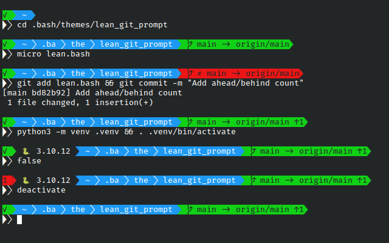

# Lean bash powerline theme with GIT support
Lean, simple and beautiful (probably) bash theme, with GIT support.



## Features

* Display last command status / exit code
* Support for fish-shell like shortening of current working directory (configurable)
* Hide user/hostname when working local (configurable)
* Fast GIT prompt, even on Windows (see *Benchmark* below)
* Switchable display of GIT upstream branch
* Switchable display of GIT dirty state

## Prerequisites

* You need a powerline enabled font configured in your terminal. Find one here: [nerdfonts.com](https://www.nerdfonts.com/) or use [Cascadia Code PL](https://github.com/microsoft/cascadia-code).

## Installation

Source the `lean.bash` file from this repository in your `.bashrc`. You can do the following:

```bash
THEME_DIR=~/.bash/themes/lean_git_prompt
mkdir -p "THEME_DIR"
git clone https://github.com/gaeeronimo/lean_git_prompt.git "$THEME_DIR"
```

Then add these lines to your `.bashrc`:

```bash
THEME=~/.bash/themes/lean_git_prompt/lean.bash
if [ -f "$THEME" ]; then
    . "$THEME"
fi
unset THEME
```

## Configuration

After including the `lean.bash` theme, the prompt looks may be configured by setting env variables either in `.bashrc` or later on the command line. To switch off a certain configuration, set the variable to an empty string or unset it. To switch on, set it to any string.

Default configuration:

```bash
# Enable shortening of CWD: foo/bar/dir => f/b/dir
LEAN_PS1_SHORTEN_CWD=1

# Switch to GIT standard prompt __git_ps1 for GIT prompt segment
LEAN_PS1_GIT_PS1=

# Show current dirty state of GIT working tree
GIT_PS1_SHOWDIRTYSTATE=

# Show upstream branch
GIT_PS1_SHOWUPSTREAM=1
```

You may configure the color of the segments and the characters used within the prompt. Take a look at the *configuration* section in `lean.bash`.

## Benchmark

I built this mainly because the (powerline) prompts I tested so far with GIT support on Windows where too slow for my taste. For main usecases the prompt should be faster than the default __git_ps1 prompt and other PL enabled prompts (like oh-my-bash/agnoster).

Here are some numbers, measured on my work laptop with my main daily work repository:

Prompt                                 | SHOWUPSTREAM | SHOWDIRTYSTATE | Time (real)
---------------------------------------|:------------:|:--------------:|------------:
`lean.bash: __lean_ps1`                |              |                | ~   100ms
`git-prompt.sh: __git_ps1`             |              |                | ~   140ms
`lean.bash: __lean_ps1`                |       X      |                | ~   180ms
`git-prompt.sh: __git_ps1`             |       X      |                | ~   280ms
`lean.bash: __lean_ps1`                |       X      |        X       | ~   350ms
`git-prompt.sh: __git_ps1`             |       X      |        X       | ~   520ms
`oh-my-bash/agnoster: set_bash_prompt` |              |        X       | ~ 1.100ms

And here's the benchmark for a non-GIT CWD:

Prompt                                 | Time (real)
---------------------------------------|------------:
`lean.bash: __lean_ps1`                | ~  30ms
`git-prompt.sh: __git_ps1`             | ~  80ms
`oh-my-bash/agnoster: set_bash_prompt` | ~ 530ms

Personally I find everything that exceeds ~ 200 ms unbearable for daily work, so `lean.bash` comes with disabled dirty state by default.

# License
MIT